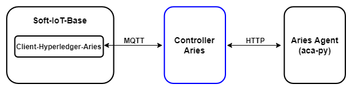

# Controller Agent Aries

O `controller-agent-aries` é o projeto responsável por fazer a intermediação entre o soft-iot-base e o _Aries Agent_ (aca-py). Ele é capaz de publicar/assinar em tópicos para se comunicar com bundle [soft-iot-dlt-client-hyperledger-aries](https://github.com/JoaoErick/soft-iot-dlt-client-hyperledger-aries) e enviar requisições HTTP para o [_Aries Agent_ (aca-py)](https://github.com/hyperledger/aries-cloudagent-python).

<a name="readme-top"></a>

## Modelo da arquitetura

<p align="center">
  
</p>

---

## Interações com o __Aries Agent__

| Funções                | Descrição                                        |
| ---------------------- | ------------------------------------------------ |
| getAriesClient()       | Solicita uma instância do Aries Cloud Agent         |
| credentialDefinition() | Solicita a criação e envio de uma definição de credencial para o __ledger__ |
| createInvitation() | Solicita a geração de uma URL de conexão |
| receiveInvitation() | Solicita a conexão entre agentes a partir da URL recebida |
| issueCredentialV1() | Solicita o envio de uma credencial v1.0 para um agente |

---

## Interações MQTT com o bundle __Client-Hyperledger-Aries__

| Tópicos de Assinatura       | Descrição                                        |
| --------------------------- | ------------------------------------------------ |
| POST CREDENTIAL_DEFINITIONS | Recebe a solicitação para criar uma definição de credencial |
| POST CREATE_INVITATION      | Recebe a solicitação para gerar uma URL de conexão |
| POST ACCEPT_INVITATION      | Recebe a solicitação para estabelecer a conexão entre agentes |
| POST ISSUE_CREDENTIAL       | Recebe a solicitação para emitir uma credencial para um outro agente |

| Tópicos de Publicação       | Descrição                                        |
| --------------------------- | ------------------------------------------------ |
| CREDENTIAL_DEFINITIONS_RES  | Envia a confirmação de que a definição de credencial foi criada ou resgatada |
| CREATE_INVITATION_RES       | Envia a URL de conexão gerada |
| ACCEPT_INVITATION_RES       | Envia a confirmação de que a conexão entre agentes foi estabelecida |

---

## Execução utilizando Docker

### Pré-requisitos

Antes de executar o projeto, é necessário a instalação das dependências abaixo:
* [Docker](https://www.docker.com)
* [Apache Maven](https://maven.apache.org/install.html)

### Tutorial básico

1. Clone este projeto [controller-agent-aries](https://github.com/JoaoErick/controller-agent-aries)
2. No diretório raiz do projeto, abra o terminal
3. Faça a compilação do projeto com o comando:
   ```sh
   mvn clean compile assembly:single
   ```
4. Inicie o `Docker` em seu computador
 
5. Ainda no terminal, construa a imagem docker deste projeto com:
   ```sh
   docker build -t <nome-imagem> .
   ```
6. Crie um container a partir da imagem criada com:
   ```sh
   docker run -it <nome-imagem>
   ```
<p align="right">(<a href="#readme-top">back to top</a>)</p>